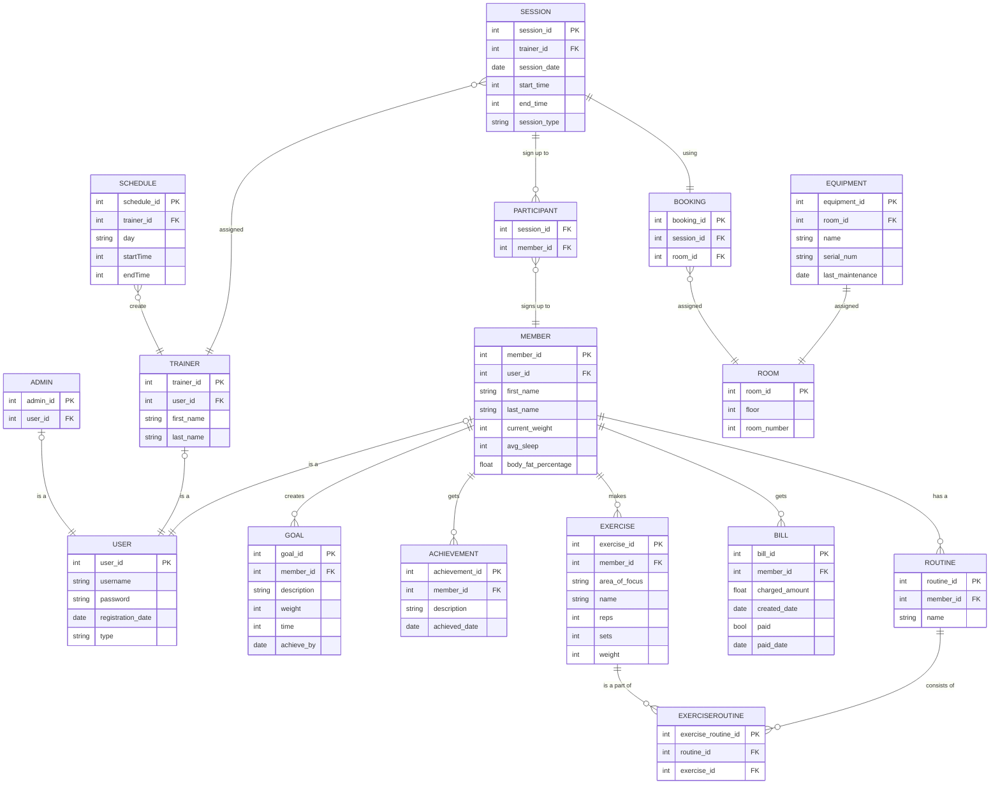

```mermaid
erDiagram
  ADMIN |o--|| USER : "is a"
  TRAINER |o--|| USER : "is a"
  MEMBER |o--|| USER: "is a"

  MEMBER ||--o{ GOAL : creates
  MEMBER ||--o{ ACHIEVEMENT: gets
  MEMBER ||--o{ EXERCISE: "makes"
  MEMBER ||--o{ BILL: gets

  EXERCISE ||--o{ EXERCISEROUTINE: "is a part of"
  ROUTINE ||--o{ EXERCISEROUTINE: "consists of"

  MEMBER ||--o{ ROUTINE: "has a"

  SCHEDULE }o--|| TRAINER : create
  SESSION }o--|| TRAINER : assigned
  SESSION ||--o{ PARTICIPANT : "sign up to"
  PARTICIPANT }o--|| MEMBER: "signs up to"

  BOOKING }o--|| ROOM : assigned
  SESSION ||--|| BOOKING : using
  EQUIPMENT ||--|| ROOM : assigned


  USER {
    int user_id PK
    string username
    string password
    date registration_date
    string type
  }

  MEMBER {
    int member_id PK
    int user_id FK 
    string first_name
    string last_name
    int current_weight
    int avg_sleep
    float body_fat_percentage
  }

  TRAINER {
    int trainer_id PK
    int user_id FK
    string first_name
    string last_name
  }

  ADMIN {
    int admin_id PK
    int user_id FK
  }

  GOAL {
    int goal_id PK
    int member_id FK
    string description
    int weight
    int time
    date achieve_by
  }
  
  ACHIEVEMENT {
    int achievement_id PK
    int member_id FK
    string description
    date achieved_date
  }

  EXERCISE {
    int exercise_id PK
    int member_id FK
    string area_of_focus
    string name
    int reps
    int sets
    int weight
  }

  ROUTINE {
    int routine_id PK
    int member_id FK
    string name
  }

  EXERCISEROUTINE {
    int exercise_routine_id PK
    int routine_id FK
    int exercise_id FK
  }

  SCHEDULE {
    int schedule_id PK
    int trainer_id FK
    string day 
    int startTime
    int endTime
  }

  SESSION {
    int session_id PK
    int trainer_id FK
    date session_date
    int start_time
    int end_time
    string session_type
  }

  PARTICIPANT {
    int session_id FK
    int member_id FK
  }

  ROOM {
    int room_id PK
    int floor
    int room_number
  }

  BOOKING {
    int booking_id PK
    int session_id FK
    int room_id FK
  }

  EQUIPMENT {
    int equipment_id PK
    int room_id FK
    string name
    string serial_num
    date last_maintenance
  }

  BILL {
    int bill_id PK
    int member_id FK
    float charged_amount
    date created_date
    bool paid
    date paid_date
  }

```